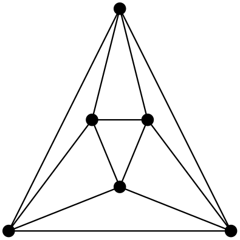

## Small-world networks

A network is considered *small-world* if:

- it has a tendency to form local groups of vertices (high clustering), and
- typical travel between vertices is short (small average path length).

This viewpoint follows the standard small-world framework in [@watts1998collective; @newman2018networks].

### Clustering coefficient

Definitions and interpretations in this section follow standard network-science usage [@newman2018networks].

The local clustering coefficient is

$$
C(v)=
\begin{cases}
\dfrac{|E(G[N_G(v)])|}{{\deg_G(v) \choose 2}} & \deg_G(v) > 1,\\
0 & \deg_G(v) \in \{0,1\}.
\end{cases}
$$

$C(v)$ can be interpreted as the probability that two neighbors of $v$ are connected.

The average clustering coefficient is

$$
C(G) = \frac{1}{n}\sum_{v\in V(G)} C(v).
$$

### Average path length

Let $d(u,v)$ be the shortest-path distance between vertices $u$ and $v$.

The average shortest path length is

$$
L(G) = \frac{1}{n(n-1)}\sum_{u\neq v} d(u,v)
= \frac{2}{n(n-1)}\sum_{\{u,v\}\subseteq V} d(u,v).
$$

## Extreme examples

- Star $S_n$: short paths, no clustering.

$$
L(S_n)=\frac{1}{n(n-1)}\left((n-1)+2{n-1\choose2}\right)=\frac{n+1}{n},
\qquad C(S_n)=0.
$$

- Cycle $C_n$: long paths, no clustering.

$$
L(C_n)\approx\frac{n+1}{2}\;\text{(odd $n$)},\qquad C(C_n)=0.
$$

- Complete graph $K_n$: shortest possible paths and maximal clustering, but dense.

$$
L(K_n)=1,\qquad \rho(K_n)=1.
$$


### Maximizing edges with zero clustering

::: {.callout-note title="Definition (Extremal number)"}
For integers $n \ge 1$ and $r \ge 1$, define

$$
\operatorname{ex}(n;K_{r+1}) = \max\{\,|E(G)| : |V(G)|=n \text{ and } K_{r+1} \not\subseteq G\,\}.
$$

That is, $\operatorname{ex}(n;K_{r+1})$ is the maximum number of edges in an $n$-vertex graph containing no copy of $K_{r+1}$.
:::

::: {.callout-note title="Definition (Turan graph)"}
For integers $n \ge 1$ and $r \ge 1$, the Turan graph $T_r(n)$ is the complete $r$-partite graph on $n$ vertices whose part sizes differ by at most $1$.

Set

$$
t_r(n) := |E(T_r(n))|.
$$
:::

::: {.callout-important title="Theorem (Turan)"}
Let $n \ge 1$ and $r \ge 1$. If $G$ is a graph on $n$ vertices with

$$
|E(G)| > t_r(n),
$$

then $G$ contains $K_{r+1}$ as a subgraph.

Equivalently,

$$
\operatorname{ex}(n;K_{r+1}) = t_r(n),
$$

and equality is attained by $T_r(n)$.

Reference: [@diestel2017graph].
:::

## Classic graph families

::: {.callout-note appearance="simple" title="Task 1"}
Compute $C(G)$ and $L(G)$ for the graph 
:::

::: {.callout-note appearance="simple" title="Task 2"}
Compute $C(G)$ and $L(G)$ for the wheel graph $W_n$ (a cycle $C_n$ plus one hub adjacent to all cycle vertices).
:::

::: {.callout-note appearance="simple" title="Task 3"}
Compute $C(G)$ and $L(G)$ for the complete bipartite graph $K_{n,n}$.
:::

::: {.callout-note appearance="simple" title="Task 4"}
Compute $C(G)$ and $L(G)$ for the complete tripartite graph $K_{n,n,n}$.
:::

::: {.callout-note appearance="simple" title="Task 5"}
Compute $C(G)$ and $L(G)$ for graph $B_{n,n}$ defined as follows:

- take two copies of $C_n$,
- connect the copies with all possible cross edges (a complete bipartite connection).
:::

::: {.callout-note appearance="simple" title="Task 6"}
Compute $L(G)$ for $K_n \times K_n$ (Cartesian product).
:::

::: {.callout-note appearance="simple" title="Task 7"}
Compute the average path length of ring lattice $C_{n,k}$ for odd $n$.
:::

## Diameter and scaling

The diameter is

$$
\operatorname{diam}(G)=\max_{u,v\in V} d(u,v).
$$

::: {.callout-note}
Average shortest path length is bounded by diameter: $L(G) \leq \operatorname{diam}(G)$.
:::

::: {.callout-note appearance="simple" title="Task 8"}
Find the diameter of a square lattice (grid) with $L$ edges per side (equivalently $L+1$ vertices) on each side.
:::

::: {.callout-note appearance="simple" title="Task 9"}
Find the diameter of the corresponding $d$-dimensional hypercubic lattice with $L$ edges per side. Express it also as a function of the number of vertices $n$.
:::

::: {.callout-note appearance="simple" title="Task 10"}
A Cayley tree has branching factor $k-1$ away from the root. Show that the number of vertices reached exactly at distance $d\ge1$ from the root is

$$
k(k-1)^{d-1},
$$

then derive an expression for diameter in terms of $k$ and $n$.
:::

::: {.callout-note appearance="simple" title="Task 11"}
Let a binary tree have $d$ levels and additionally connect sibling leaves on the last level. Express the clustering coefficient as a function of $d$.
:::


```{python}
#| echo: false
#| output: asis
#import json
#import os
#from pathlib import Path
#
#
#def _is_show_solutions_enabled() -> bool:
#  quarto_info_path = Path(os.environ["QUARTO_EXECUTE_INFO"])
#  quarto_info = json.loads(quarto_info_path.read_text(encoding="utf-8"))
#  params = quarto_info.get("metadata", {}).get("params", {})
#  return bool(params.get("show-solutions", False))
#
#
#def _read_local_solutions() -> str:
#  local_path = Path("02/2cv-merged-solutions.local.qmd")
#  if local_path.exists():
#    return local_path.read_text(encoding="utf-8")
#  return """
#::: {.callout-warning title=\"Local solutions file not found\"}
#Sorry!
#:::
#"""
#
#
#if _is_show_solutions_enabled():
#  print(_read_local_solutions())
```
